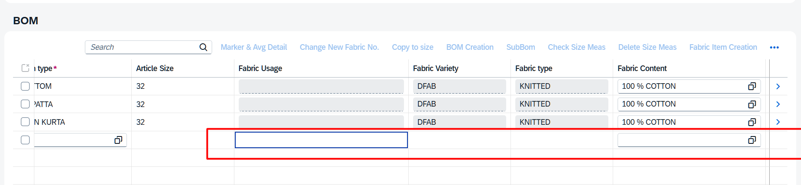

# Restricting Inline Creation Row Fields in SAP Fiori Elements V4

> **Author:** Generated from implementation on PLM Markers and Measurements project  
> **Date:** April 30, 2026  
> **Applies to:** SAP Fiori Elements V4 | OData V4 | ABAP RAP | GridTable with InlineCreationRows

---

## 1. The Problem

When you configure a table with `"creationMode": { "name": "InlineCreationRows" }` in `manifest.json`, Fiori Elements renders an empty row at the bottom of the table — the **"ghost row"** or **transient row**.

**The Issue:** Even though your ABAP RAP `get_instance_features` correctly restricts fields on existing rows based on user authorization (e.g., department roles), the ghost row **ignores all dynamic field control** and remains fully editable.

### Visual Example

In the image below:
- **Existing rows** (BOTTOM, PATTA, N KURTA) have `Fabric Usage` and `Fabric type` fields grayed out — controlled by `get_instance_features`
- **The ghost row** (bottom) has those same fields **still editable** — the restriction is NOT applied



### Root Cause

`get_instance_features` is an **instance-level** method — it needs an existing entity (with keys) to evaluate. The ghost row is a **transient client-side placeholder** — it has no keys, no draft, no backend representation. The backend is never consulted for it.

```
Timeline:
1. User opens Object Page
2. Backend returns BOM rows + __FieldControl per row  ← works ✅
3. FE renders existing rows with restrictions          ← works ✅
4. FE creates ghost row CLIENT-SIDE (no backend call)  ← NO __FieldControl ❌
5. Ghost row renders all fields as editable            ← problem!
```

---

## 2. Key Concepts

### 2.1 `__FieldControl` Complex Type

When you declare `field ( features : instance )` in your BDEF, RAP automatically:
1. Generates a complex type with an integer property per controlled field
2. Adds `__FieldControl` to the OData entity response
3. Populates it via `get_instance_features` on every READ

**Field Control Integer Values:**

| Value | Constant in ABAP | Meaning | UI Effect |
|-------|-------------------|---------|-----------|
| `0` | `fc-f-hidden` | Hidden | Field not visible |
| `1` | `fc-f-read_only` | ReadOnly | Displayed but not editable |
| `3` | `fc-f-editable` | Editable | Fully editable (default) |
| `7` | `fc-f-mandatory` | Mandatory | Editable + required marker |

### 2.2 FE V4 GridTable Cell Hierarchy

Each cell in an FE V4 GridTable is a **3-level nested wrapper**, NOT a simple `sap.m.Input`:

```
sap.fe.macros.field.FieldAPI              ← row.getCells() returns this
  └── sap.fe.macros.controls.FieldWrapper  ← FieldAPI.getContent()
        └── sap.ui.mdc.Field               ← FieldWrapper.getContentEdit()[0]
```

> **Critical:** Calling `setEditable(false)` on the outer FieldAPI does NOTHING.  
> You must drill to the inner `sap.ui.mdc.Field` and call `setEditMode("Display")`.

### 2.3 Transient Context

The ghost row has a **transient OData V4 context**. You identify it via:
```javascript
oContext.isTransient()  // true = ghost row, false = existing row
```

### 2.4 Element Registry

In FE V4, the Object Page lives inside a nested Component container. Regular methods like `getRootControl().findAggregatedObjects()` **cannot reach** controls inside it. Use the global Element registry instead:
```javascript
var Element = sap.ui.require("sap/ui/core/Element");
Element.registry.forEach(function(oElement) { /* searches ALL live controls */ });
```

---

## 3. Approaches That Do NOT Work

| Approach | Why It Fails |
|----------|-------------|
| **Controller Extension (`extends` block)** | In many FE V4 apps, the extension hooks (`onInit`, `onAfterRendering`, `editFlow.onAfterEdit`) silently never trigger |
| **`controllerName` in target settings** | Not a valid FE V4 ObjectPage Component setting → throws assertion error |
| **`setEditable(false)` on FieldAPI** | The outer wrapper ignores this; rendering is controlled by the inner MDC Field |
| **Backend `determination on modify`** | Doesn't trigger until mandatory fields are filled; creates empty draft problem |
| **Default values function** | Same issue — doesn't fire until mandatory fields have values |
| **`getRootControl().findAggregatedObjects()`** | Stops at Component boundaries; cannot find tables inside the ObjectPage |

---

## 4. The Working Solution

### Architecture

```
Component.init()
  └── setInterval (every 3 seconds)
        └── Find BOM table via Element.registry
              └── Read __FieldControl from first existing row
                    └── Attach rowsUpdated listener on inner GridTable
                          └── On every render: find transient rows → lock cells
```

### 4.1 Backend Prerequisites

Your BDEF must declare instance-controlled fields:

```abap
define behavior for ZI_STYLE_BOM_COMP_VIEW
{
  field ( features : instance ) FabricType, FabricContent, FabricBase, FabricUsage;
}
```

Your `get_instance_features` performs auth checks:

```abap
METHOD get_instance_features.
  AUTHORITY-CHECK OBJECT 'Z_DEPT'
    ID 'ACTVT' FIELD '02'
    ID 'Z_DEPT' FIELD 'FABRIC'.

  IF sy-subrc <> 0.
    " User lacks fabric department auth → lock fields
    APPEND VALUE #(
      %tky               = key-%tky
      %field-FabricType   = if_abap_behv=>fc-f-read_only
      %field-FabricContent = if_abap_behv=>fc-f-read_only
    ) TO result.
  ENDIF.
ENDMETHOD.
```

### 4.2 Frontend: Complete Component.js Template

> **To adapt for a different app, change only 2 things:**
> 1. Line 6: Component class name
> 2. Line 57: Navigation property path (e.g., `"_bom"` → `"_items"`)

```javascript
sap.ui.define(
    ["sap/fe/core/AppComponent"],
    function (AppComponent) {
        "use strict";

        return AppComponent.extend("your.app.namespace.Component", {  // ← CHANGE #1
            metadata: { manifest: "json" },

            init: function () {
                AppComponent.prototype.init.apply(this, arguments);
                var that = this;
                this._fieldControlMap = null;
                this._rowsUpdateAttached = false;
                this._iWatcherInterval = setInterval(function () {
                    that._tryApplyFieldControl();
                }, 3000);
            },

            destroy: function () {
                if (this._iWatcherInterval) { clearInterval(this._iWatcherInterval); }
                AppComponent.prototype.destroy.apply(this, arguments);
            },

            _tryApplyFieldControl: function () {
                var oMdcTable = this._findTargetTable();
                if (!oMdcTable) { return; }
                if (!this._fieldControlMap) {
                    this._readFieldControlFromExistingRows(oMdcTable);
                }
                if (!this._fieldControlMap) { return; }
                var oInnerTable = oMdcTable._oTable;
                if (!oInnerTable) { return; }
                if (!this._rowsUpdateAttached) {
                    var that = this;
                    oInnerTable.attachRowsUpdated(function () {
                        that._processCreationRows(oInnerTable);
                    });
                    this._rowsUpdateAttached = true;
                }
                this._processCreationRows(oInnerTable);
            },

            // ═══════════════════════════════════════════
            // STEP 1: Find target table via Element registry
            // ═══════════════════════════════════════════
            _findTargetTable: function () {
                var oFoundTable = null;
                try {
                    var Element = sap.ui.require("sap/ui/core/Element");
                    if (Element && Element.registry) {
                        Element.registry.forEach(function (oEl) {
                            if (!oFoundTable && oEl.isA && oEl.isA("sap.ui.mdc.Table")) {
                                var oRB = oEl.getRowBinding && oEl.getRowBinding();
                                if (oRB && oRB.getPath() === "_bom") {  // ← CHANGE #2
                                    oFoundTable = oEl;
                                }
                            }
                        });
                    }
                } catch (e) { /* not rendered yet */ }
                return oFoundTable;
            },

            // ═══════════════════════════════════════════
            // STEP 2: Read __FieldControl from existing row
            // ═══════════════════════════════════════════
            _readFieldControlFromExistingRows: function (oMdcTable) {
                var oRB = oMdcTable.getRowBinding();
                if (!oRB) { return; }
                var aC = oRB.getContexts();
                for (var i = 0; i < aC.length; i++) {
                    if (aC[i] && !aC[i].isTransient()) {
                        try {
                            var oFC = aC[i].getObject("__FieldControl");
                            if (oFC) { this._fieldControlMap = oFC; return; }
                        } catch (e) { }
                        try {
                            var oData = aC[i].getObject();
                            if (oData && oData.__FieldControl) {
                                this._fieldControlMap = oData.__FieldControl;
                                return;
                            }
                        } catch (e) { }
                    }
                }
            },

            // ═══════════════════════════════════════════
            // STEP 3: Find ghost rows and lock fields
            // ═══════════════════════════════════════════
            _processCreationRows: function (oInnerTable) {
                if (!this._fieldControlMap) { return; }
                var aRows = oInnerTable.getRows();
                for (var i = 0; i < aRows.length; i++) {
                    var oCtx = aRows[i].getBindingContext();
                    if (oCtx && oCtx.isTransient && oCtx.isTransient()) {
                        this._applyFieldControlToRow(aRows[i]);
                    }
                }
            },

            _applyFieldControlToRow: function (oRow) {
                var aCells = oRow.getCells();
                for (var i = 0; i < aCells.length; i++) {
                    var sProp = this._getPropName(aCells[i]);
                    if (sProp && this._fieldControlMap.hasOwnProperty(sProp)) {
                        var v = this._fieldControlMap[sProp];
                        if (v === 0 || v === 1) { this._lockCell(aCells[i]); }
                    }
                }
            },

            // ═══════════════════════════════════════════
            // STEP 4: Drill into FE V4 control hierarchy
            // ═══════════════════════════════════════════
            _getPropName: function (oCell) {
                var oMF = this._getInnerMdcField(oCell);
                if (oMF) {
                    var s = this._bp(oMF, "value") || this._bp(oMF, "text") || this._bp(oMF, "selected");
                    if (s) { return s; }
                }
                return this._bp(oCell, "value") || this._bp(oCell, "selected") || this._bp(oCell, "text");
            },

            _getInnerMdcField: function (oCell) {
                var oW = null;
                if (oCell.getContent) {
                    var c = oCell.getContent();
                    oW = Array.isArray(c) ? c[0] : c;
                }
                if (!oW) { return null; }
                if (oW.getContentEdit) {
                    var aEC = oW.getContentEdit();
                    if (aEC && aEC.length > 0) { return aEC[0]; }
                }
                if (oW.getContentDisplay) {
                    var aDC = oW.getContentDisplay();
                    if (aDC && aDC.length > 0) { return aDC[0]; }
                }
                return oW;
            },

            _bp: function (o, p) {
                if (!o) { return null; }
                var bi = o.getBindingInfo(p);
                if (bi && bi.parts && bi.parts.length > 0 && bi.parts[0].path) {
                    var segs = bi.parts[0].path.split("/");
                    return segs[segs.length - 1];
                }
                return null;
            },

            // ═══════════════════════════════════════════
            // STEP 5: Lock via setEditMode("Display")
            // ═══════════════════════════════════════════
            _lockCell: function (oCell) {
                if (oCell.setEditable) { oCell.setEditable(false); }
                var oMF = this._getInnerMdcField(oCell);
                if (oMF) {
                    if (oMF.setEditMode) { oMF.setEditMode("Display"); }
                    if (oMF.setEditable) { oMF.setEditable(false); }
                    if (oMF.setEnabled) { oMF.setEnabled(false); }
                }
            }
        });
    }
);
```

---

## 5. Step-by-Step: Reuse in a New App

| Step | Action |
|------|--------|
| **1** | Ensure your BDEF has `field ( features : instance )` for the child entity |
| **2** | Implement `get_instance_features` with your `AUTHORITY-CHECK` logic |
| **3** | Verify `__FieldControl` appears in the OData response (Network tab → GET request for child entity) |
| **4** | Copy the Component.js template above into your app's `webapp/Component.js` |
| **5** | Change the **Component class name** (line 6) to match your app namespace |
| **6** | Change the **binding path** (line 57) to your child entity's navigation property |
| **7** | Test: Open Object Page with existing child rows → Edit → Check ghost row after ~3 seconds |

---

## 6. Debugging Tips

Add these console logs to trace execution:

```javascript
// In _tryApplyFieldControl:
console.log("Table found:", !!oMdcTable);
console.log("Field control map:", JSON.stringify(this._fieldControlMap));

// In _processCreationRows:
console.log("Transient row found at index:", i);

// In _lockCell - to see which fields get locked:
console.log("Locking field:", sProp);
```

**Check the OData response directly:**
```
Browser DevTools → Network → Filter by "$batch" or your entity name
→ Look for __FieldControl in the JSON response
```

---

## 7. Known Limitations

| Limitation | Impact | Workaround |
|---|---|---|
| **No existing rows** | If child table is empty, no `__FieldControl` to read | Create an unbound OData function that returns field control map |
| **3-second delay** | Brief window where ghost row is fully editable | Reduce interval to 1000ms |
| **Per-user assumption** | Code reads from ONE row and applies to all | Only works when auth is user-based (not row-based) |
| **UI5 version changes** | SAP could change internal control hierarchy | Re-test after major UI5 upgrades |

---

## 8. Glossary

| Term | Definition |
|---|---|
| **Ghost Row / Transient Row** | Empty row at bottom of table when `InlineCreationRows` is configured |
| **`__FieldControl`** | Complex type added by RAP containing field editability integers |
| **`get_instance_features`** | ABAP RAP method that sets field/action availability per entity instance |
| **`sap.ui.mdc.Field`** | Internal MDC field control used by FE V4 table cells |
| **`Element.registry`** | Global registry of all live SAPUI5 controls (bypasses Component boundaries) |
| **`isTransient()`** | Returns `true` for unsaved client-side-only contexts (ghost rows) |
| **`setEditMode("Display")`** | The method on `sap.ui.mdc.Field` that makes it read-only |

---

## 9. Files Modified in This Project

| File | Change |
|---|---|
| `webapp/Component.js` | Added watcher, field control reader, cell locking logic |
| `webapp/Component-dbg.js` | Same (debug version with full comments) |
| `manifest.json` | No changes needed |
